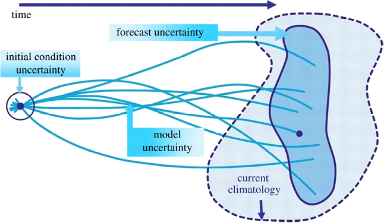

```{r setup, include=FALSE, warning=FALSE}
options(
  htmltools.dir.version = FALSE,
  width = 100
)
knitr::opts_chunk$set(echo = TRUE)
```

```{r, include = FALSE}
library(meteoland)
```

class: title-slide

# Introduction to climate data sources

### Miquel De Cáceres, Victor Granda

### Ecosystem Modelling Facility

### `r as.Date("2022-11-30")`


---
class: center

<div class=my-header>
    
</div>

<div class=my-footer></div>

# Outline

## 1. Preliminaries

###  a. What do I need?
###  b. Climate models 
###  c. Climate data formats

--

## 2. Historic climate

###  a. Point data sources
###  b. Gridded data sources
###  c. Interpolating by yourself

--

## 3. Future climate

###  a. Climate scenarios and uncertainty
###  b. Downscaling projections
###  c. Projection data sources

---
layout: true

<div class=my-header>
    
</div>

<div class=my-footer></div>

# 1a. Preliminaries: What do I need?

---

## *What kind of climate information do I need?*

+ **Weather** - What actually *happens* in the atmosphere

+ **Climatology** - Statistical distribution for a given period (typically 30 years): What you *expect* in the atmosphere

+ **Climate anomalies** - Comparison of what happened vs. what you expected

--

## *What is the temporal extent and temporal resolution?*

+ **Historical** -  Before present

+ **Short-term forecast** -  Few days/weeks in advance

+ **Mid-term predictions** - Seasonal to decadal predictions

+ **Climate projections** - Long-term predictions

--

## *What is the spatial extent and resolution?*

+ **Point locations** - E.g. forest plots or sampling locations

+ **Gridded** - Cells of a given resolution over a target area

+ **Area-wise means** - Area-average statistics

---
layout: true

<div class=my-header>
    
</div>

<div class=my-footer></div>

# 1b. Preliminaries: Climate models

---

## *What are climate models?*

+ **General Circulation Models** (GCMs) comprise atmosphere, ocean and sea ice components

.center[
  
]


+ They are a subset of **Earth System Models** (ESMs), which also include land use changes, carbon cycle, vegetation dynamics, ...

---

## *What are they used for?*

+ **Paleoclimate reconstruction** - Past climatology according to conditions on earth

+ **Historical reanalysis** -  Generate historical 3D weather fields to complete observations

+ **Short-term forecast** -  Operational weather prediction few days/weeks in advance

+ **Mid-term predictions** - Seasonal to decadal climate predictions

+ **Climate projections** - Long-term predictions of future climatology

---

## Initial conditions vs. boundary conditions

.pull-left[
### Effect of initial conditions

  
]

--

.pull-right[
### Effect of boundary conditions
  
]

---

## Initial conditions vs. boundary conditions

*Initial conditions* are very relevant for **short-term** weather forecasts, whereas *boundary conditions* are very relevant for **long-term** climate simulation


.center[

  
]

---

## Data assimilation

Both **weather forecast** and **historical reanalysis** products use **data assimilation** techniques to *constrain* climate model predictions with observations:

.center[
  
]

---
layout: true

<div class=my-header>
    
</div>

<div class=my-footer></div>

# 1c. Climate file formats

---

.pull-left[
## Formats specific for climate data

  + **GRIB - Gridded Binary** by World Meteorological Organization
  
  + **NetCDF - Network Common Data Format** by Unidata (UCAR/NCAR)
  
  + **HDF - Hierarchical Data Format**.


.center[*The netCDF user communities have numerous conventions for creating the contents of netCDF files, in particular, the commonly used [CF  conventions](http://cfconventions.org/cf-conventions/cf-conventions.html)* ]

]

--

.pull-right[

## General-purpose GIS data formats

  + **GeoTIFF** for raster data
  
  + **Geopackage**
  
  + ...
  
]  

---
layout: true

<div class=my-header>
    
</div>

<div class=my-footer></div>

# 2a. Historic climate: Point data sources

---

## *What should I know about point data sources?*

+ They are provided by national weather services (or non-professional networks)

+ Quality control is important (sensors may fail or produce wrong data)

+ Not all stations are made available

+ User registration is sometimes needed

--

## R packages to access historic point data networks

|  Spatial extent |  Network(s)          |  R package               |    Access    |
|-----------------|----------------------|--------------------------|--------------|
|  Global         | NOAA Integrated Surface Database (ISD)  |  `worldmet`              | CRAN |
|  Canada         | Environment and Climate Change Canada (ECCC) | `weathercan`        | Ropensci |
|  Spain          | AEMET, SMC, MeteoGalicia, RIA, MeteoClimatic | `meteospain`        | CRAN |
|  Germany        | German Weather Service              | `rdwd`  | CRAN |
|  United States  | NOAA National Climatic Data Center | `rnoaa` | CRAN |


---
layout: true

<div class=my-header>
    
</div>

<div class=my-footer></div>

# 2b. Historic climate: Gridded data sources

---

## *How was the gridded data generated?*

  + **Statistical estimation** - performs an estimation of weather at new locations from available point observations. Can be used to obtain fine-grained grids, but the real resolution is defined by reference weather data.
  
  + **Reanalysis** - involves dynamic climate models that simulate historic climate constrained by observations (more about this later). It is more physically consistent, but spatial resolution is often coarser.
  
.center[
  
]


---

## Gridded data sources

| Source  | Spatial extent | Spatial resolution |  R package |
|---------|----------------|--------------------|------------|
| [WorldClim](http://www.worldclim.org/) | Global | 20 km |  `geodata` |
| [PaleoClim](http://www.paleoclim.org/) | Global | 5 km | |
| [DayMet](https://daymet.ornl.gov/)   | United States |  1 km | `daymetr` |
| [Copernicus Data Store](https://cds.climate.copernicus.eu/) | Europe |   | `ecmwfr` |
| [Moreno & Hasenauer 2016](https://doi.org/10.1002/joc.4436) | Europe | 1 km | `easyclimate` |
| [AEMET](http://www.aemet.es/es/serviciosclimaticos) | Spain |   | |


---
layout: true

<div class=my-header>
    
</div>

<div class=my-footer></div>

# 2c. Historic climate: Interpolation by yourself

---

## *What do I need to know about weather interpolation?*

  1. There are several interpolation methods (distance-based, krigging,…)
  
  2. Interpolating climatological means is easier than interpolating actual weather
  
  3. Interpolation quality depends on data quality and quantity (inhomogeneities)
  
  4. Some variables (e.g. temperature) are easier than others (e.g. precipitation)
  
--

## *When do I need to resort on interpolation?*

+ Spatial resolution of available data is too coarse

+ You want to account for local topographic effects on weather (depends on the method)

+ Density of reference point data is enough


---
layout: true

<div class=my-header>
    
</div>

<div class=my-footer></div>

# 3a. Future climate: Scenarios and projection uncertainty

---

## Climate scenarios (SRES – IPCC AR4 vs RCPs – IPCC AR5)

.center[
  
]

---

## Sources of uncertainty in climate projections

.center[
  
]

These sources imply we should consider different climate models and different scenarios when assessing climate impacts.

---
layout: true

<div class=my-header>
    
</div>

<div class=my-footer></div>

# 3b. Future climate: Downscaling projections

---

Spatial resolution of climate models increases but is limited...

.center[
  
]

... and downscaling may still be needed

---
.left[
## Dynamic downscaling
]
.right[
  
]

--

## Statistical downscaling

+ **Model output statistics** (bias correction) – calibrate relationships between climate model outputs (predictors) and observations (predictands) in present climate and apply them to climate projections.

+ **Perfect prognosis** – calibrate relationships between large-scale predictors and local-scale predictands (both observations!) and apply them to climate projections. E.g. weather types or analogues.


---
layout: true

<div class=my-header>
    
</div>

<div class=my-footer></div>

# 3c. Future climate: Projection data sources

---

## Projection data sources

| Source  | Spatial extent | CMIP |  R package |
|---------|----------------|--------------------|------------|
|  [WorldClim](http://www.worldclim.org/) |    Global  |      CMIP6           | `geodata`  |
|  [CHELSA](https://chelsa-climate.org/) |    Global  |      CMIP5/CMIP6           |   |
|  [Copernicus Data Store](https://cds.climate.copernicus.eu/) |    Europe  |      CMIP5          |  `ecmwfr` |
|  [AEMET](http://escenarios.adaptecca.es/) |    Spain  |      CMIP5           |   |

---

layout: false
class: back-slide


## Introduction to climate data sources


.center[

]


