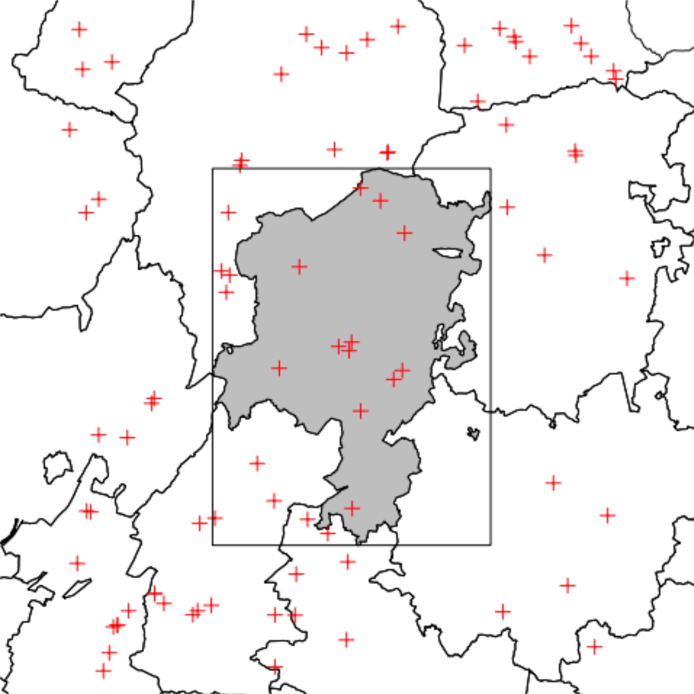
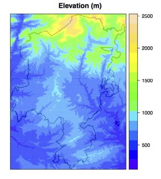
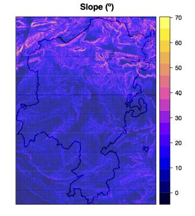
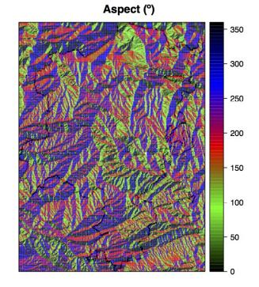
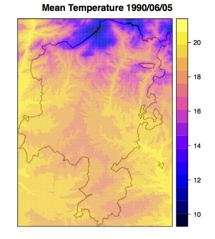
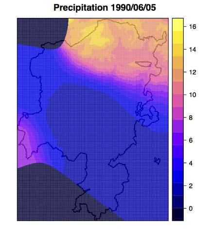
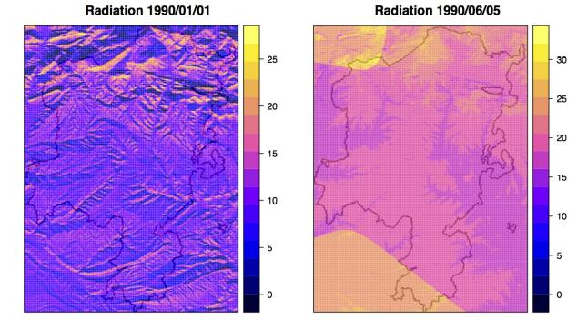

```{r setup, include=FALSE, warning=FALSE}
options(
  htmltools.dir.version = FALSE,
  width = 100
)
knitr::opts_chunk$set(echo = TRUE)
```

```{r, include = FALSE}
library(meteoland)
```

class: title-slide

# Introduction to meteoland

### Miquel De Cáceres, Victor Granda

### Ecosystem Modelling Facility

### `r as.Date("2022-11-30")`




---
class: center

<div class=my-header>
    
</div>

<div class=my-footer></div>

# Outline

## 1. Introduction

###  a. Purpose, installation and documentation
###  b. Data structures and main functions

--

## 2. Spatial interpolation

###  a. General interpolation procedure
###  b. Interpolation of weather variables
###  c. Interpolation parameters

--

## 3. Estimation of additional variables


---
layout: true

<div class=my-header>
    
</div>

<div class=my-footer></div>

# 1. Introduction: Purpose, installation and documentation

---

## Purpose

The R package **meteoland** [(De Cáceres et al., 2018)](https://doi.org/10.1016/j.envsoft.2018.08.003) provides utilities to estimate daily weather variables at any position over complex terrains. 

--

The package was designed to assist the following tasks:

+  **Spatial interpolation** of *daily* weather records from meteorological stations.

+  **Statistical correction** of meteorological data series (e.g. from climate models).

+  Multisite and multivariate stochastic **weather generation**.

--

**NOTE**: Important modifications in the package made in **ver. 2.0** have led to a completely new set of functions for spatial interpolation. At the same time, previous functions for statistical correction and weather generation have been deprecated.

---

## Installation

Package `meteoland` can be found at [CRAN](https://cran.r-project.org/package=meteoland) and installed via:
.code80[
```{r installation_cran, eval = FALSE}
install.packages("meteoland")
```
]

--

Latest stable versions can also be downloaded and installed from GitHub as
follows (package `remotes` should be installed first):
.code80[
```{r installation_github, eval = FALSE}
remotes::install_github("emf-creaf/meteoland")
```
]

--

Users can force the inclusion of vignettes in the installation:
.code80[
```{r installation vignettes, eval = FALSE}
remotes::install_github("emf-creaf/meteoland", 
                        build_opts = c("--no-resave-data", "--no-manual"),
                        build_vignettes = TRUE)
```
]

--

## Documentation

Additional articles can be found at the [package website](https://emf-creaf.github.io/meteoland/index.html).

Detailed documentation on **meteoland** calculation routines can be found
at:

.center[ https://emf-creaf.github.io/meteolandbook/index.html ]

---
layout: true

<div class=my-header>
    
</div>

<div class=my-footer></div>

# 1. Introduction: Data structures and main functions

---

## Weather data frames

| R name     | Definition                                                  | Units   |
|------------|-------------------------------------------------------------|---------|
| `DOY`      |  Day of the year                                            | [1-366] |
| `MeanTemperature`      |  Mean daily temperature                         | $^{\circ}\mathrm{C}$ |
| `MinTemperature`      |  Minimum daily temperature                       | $^{\circ}\mathrm{C}$ |
| `MaxTemperature`      |  Maximum daily temperature                       | $^{\circ}\mathrm{C}$ |
| `Precipitation`      |  Daily precipitation                              | $mm$ |
| `MeanRelativeHumidity`      |  Mean daily relative humidity              | $\%$ |
| `MinRelativeHumidity`    |  Minimum daily relative humidity              | $\%$ |
| `MaxRelativeHumidity`    |  Maximum daily relative humidity              | $\%$ |
| `Radiation`              |  Incoming shortwave solar radiation           | $MJ\cdot m^2$ |
| `MaxRelativeHumidity`    |  Maximum daily relative humidity                  | $\%$ |
| `WindSpeed`              |  Wind speed                                       | $m\cdot s^{-1}$ |
| `WindDirection`          |  Wind direction                                   | $^{\circ}$ |
| `PET`          |  Potential evapo-transpiration            | $mm$  |

---

## Target topography

### Spatial structures

  + **Points/polygons**: `sf` objects with target geometries as rows and topographic variables as columns
  + **Raster**: `stars` objects with topographic variables as attributes and space dimensions

--

### Topographic variables

+ `elevation` (in meters)
+ `slope` (in degrees from the horizontal plane)
+ `aspect` (in degrees from North)

.center[



]

---

## Weather data

### Reference point weather data

  + `sf` objects with daily weather variables as columns and time (i.e. `Date` or `POSIXct` objects) specified in a column called `dates`.

--

### Interpolated weather data

  + **Points/polygons**: `sf` objects with weather data frames in a special column called `interpolated_data`
  + **Raster**: `stars` objects with weather variables as attributes and space/time dimensions

---

## Main functions

### Interpolation

.font80[
| R function    | Description                                                  |
|---------------|--------------------------------------------------------------|
| `with_meteo()` | Checks reference weather data integrity                      |
| `create_meteo_interpolator()` | Creates object containing weather reference data       |
| `interpolator_calibration()`  | Calibration of interpolation parameters      |
| `interpolate_data()` | Interpolates weather data over target points/area      |
]

--

### Low-level utility functions

.font80[
| R function    | Description                                                  |
|---------------|--------------------------------------------------------------|
| `radiation_*()` | Set of functions used in the calculation of incoming solar radiation and net radiation.|
| `utils_*()` | Set of functions used in the calculation of physical variables.      |
| `humidity_*()` | Set of utility functions for air humidity.      |
| `penman()` | Calculation of potential evapotranspiration using Penman's formula.  |
]

---
layout: true

<div class=my-header>
    
</div>

<div class=my-footer></div>

# 2. Spatial interpolation: General interpolation procedure

---

+ The general procedure for interpolation is a form of **distance-weighted interpolation** and was developed by [Thornton, Running and White (1997)](https://www.sciencedirect.com/science/article/abs/pii/S0022169496031289). 

--

+ It is based on a **truncated Gaussian filter** with respect to a central point $p$:

$$ W(r) = e^{-\alpha \cdot (r/R_p)^2} - e^{-\alpha}$$
+ Here $r$ is the radial distance from $p$, $R_p$ is the truncation distance and $\alpha$ is the **shape parameter**.


```{r, fig.width=5, fig.height=4, fig.align='center', echo = FALSE}
par(mar=c(4,4,1,1))
r = 0:1000
R_p = 500
gf1 = exp(-3.0*((r/R_p)^2.0)) - exp(-3.0)
gf2 = exp(-6.25*((r/R_p)^2.0)) - exp(-6.25)
gf1[r>R_p] = 0
gf2[r>R_p] = 0
plot(r, gf1, type="l", ylab = "W(r)", xlab ="r")
lines(r, gf2, lty=2)
legend("topright", legend = c("alpha = 3", "alpha = 6.25"), lty=c(1,2), bty="n")
```

--

+ The spatial convolution of this filter with a set of reference stations results, for each target point, in a vector of **weights** ( $W$ ).

---

+ $R_p$ is automatically adjusted from an initial estimate ( $R_{p, initial}$ ) so that it has lower values in data-rich regions and is increased in data-poor regions.

--

+ The method, however, requires the user to specify $N$, the **average number of observations** to be included. 

--

.center[]

---
layout: true

<div class=my-header>
    
</div>

<div class=my-footer></div>

# 2. Spatial interpolation: Interpolation of weather variables

---

### Temperature

+ Prediction of temperature requires a correction for the effects of **elevation differences** between the elevation at reference stations, $z_1, ..., z_n$, and the elevation at the prediction point, $z_p$.

--

+ Instead of regressing $z_i$ on $T_i$, the independent variable is the **difference in elevations** associated with a pair of stations, and the dependent variable is the corresponding **difference in temperatures**:

$$(T_1 - T_2) = \beta_0 + \beta_1 \cdot (z_1 - z_2)$$
--

+ The temperature for the target point, $T_p$ is finally predicted using a weighted regression:

$$T_{p} = \frac{\sum_{i=1}^{n}{W_i\cdot (T_i + \beta_0 + \beta_1 \cdot(z_p - z_i))}}{\sum_{i=1}^{n}{W_i}}$$


.pull-left[
.center[]
]
.pull-right[
.center[]
]

---

### Precipitation

Predictions of precipitation are complicated by the need to predict both **precipitation occurrence** and, conditioned on this, **precipitation amount**.

**Precipitation event**

+ The precipitation occurrence probability $POP_p$ is:
$$POP_p = \frac{\sum_{i=1}^{n}{W_{o,i}\cdot PO_i}}{\sum_{i=1}^{n}{W_{o,i}}}$$

--

+ Once $POP_p$ is calculated, then precipitation occurs if $POP_p < 0.5$. 

--

**Precipitation amount**

+ Prediction of precipitation amount includes a correction for the effects of **elevation differences**.

--

+ The dependent variable in the regression function is defined as the normalized difference of the precipitation observations $P_i$ for any given pair of stations:

$$\left(\frac{P_1 - P_2}{P_1 + P_2}\right) = \beta_0 + \beta_1 \cdot (z_1 - z_2)$$

---

### Precipitation


+ To obtain the predicted daily total $P_p$ we use the following equation:

$$P_p = \frac{\sum_{i=1}^{n}{W_{o,i}\cdot P_i \cdot PO_i \cdot \left(\frac{1 + f}{1 - f} \right)}}{\sum_{i=1}^{n}{W_{o,i} \cdot PO_i}}$$
+ Here, $f = \beta_0 + \beta_1 \cdot (z_p - z_i)$.

.pull-left[
.center[]
]
.pull-right[
.center[]
]

---

### Relative humidity

+ When input station weather data does not include relative humidity, **meteoland** estimates it directly from minimum and maximum temperature.

--

+ When relative humidity has been measured at weather stations, interpolation should be preferred. 

--

+ Since relative humidity depends on temperature, interpolation is done on **dew-point temperature**, i.e. the temperature corresponding to a water vapor saturation.

--

+ Unlike temperature and precipitation, dew-point temperature is not corrected for elevation differences.

--

### Wind

Interpolation of wind characteristics depends on the amount of information available:

+ Interpolation of wind speed only

+ Interpolation of wind vectors (speed and direction)

---
layout: true

<div class=my-header>
    
</div>

<div class=my-footer></div>

# 2. Spatial interpolation: Interpolation parameters

---

+ The following table summarizes the most important interpolation parameters:

.font80[
| Parameter | R name           | Description                                                    |
|-----------|------------------|----------------------------------------------------------------|
|  $R_{p,initial}$ | `initial_Rp` |  Initial value of the truncation radius                                  |
|  $\alpha_{Tmin}$ | `alpha_MinTemperature` |  Gaussian shape parameter for minimum temperature |
|  $\alpha_{Tmax}$ | `alpha_MaxTemperature` |  Gaussian shape parameter for maximum temperature |
|  $\alpha_{Tdew}$ | `alpha_DewTemperature` |  Gaussian shape parameter for dew-point temperature |
|  $\alpha_{Pevent}$ | `alpha_PrecipitationEvent` |  Gaussian shape parameter for precipitation event |
|  $\alpha_{Pamount}$ | `alpha_PrecipitationAmount` |  Gaussian shape parameter for precipitation amount |
|  $\alpha_{wind}$ | `alpha_Wind` |  Gaussian shape parameter for wind |
|  $N_{Tmin}$ | `N_MinTemperature` |  Average number of stations for minimum temperature |
|  $N_{Tmax}$ | `N_MaxTemperature` |  Average number of stations for maximum temperature |
|  $N_{Tdew}$ | `N_DewTemperature` |  Average number of stations for dew-point temperature |
|  $N_{Pevent}$ | `N_PrecipitationEvent` |  Average number of stations for precipitation event |
|  $N_{Pamount}$ | `N_PrecipitationAmount` |  Average number of stations for precipitation amount |
|  $N_{wind}$ | `N_Wind` |  Average number of stations for wind |

]

---
layout: true

<div class=my-header>
    
</div>

<div class=my-footer></div>

# 3. Estimation of additional variables

---

###  Solar radiation

+ Potential solar radiation, $R_{pot}$, is the radiation that a surface on earth would receive if atmosphere was not present (i.e. without the effects of cloud reflection, scattering, ...). 

+ $R_{pot}$ is estimated according to latitude and topography.

--

+ Incident solar radiation, $R_g$, is the amount of (short-wave, direct) solar radiation reaching the surface after accounting for the atmosphere. 

--

+ Following [Thornton, Running and White (1997)](https://www.sciencedirect.com/science/article/abs/pii/S0022169496031289), in **meteoland** is estimated $R_{g}$ using:

$$R_g = R_{pot} \cdot T_{t,max} \cdot T_{f,max}$$

+ Here, $T_{t,max}$ is the maximum (cloud-free) transmittance, which depends on temperature and relative humidity, and $T_{f,max}$ is the proportion of $T_{t,max}$ realized (cloud correction). 

--

.center[]

---

### Potential evapotranspiration

+ Potential evapotranspiration ( $E_{pot}$ ) is estimated once all other variables have been processed.

--

+ If wind speed is available, the [Penman (1948)](https://doi.org/10.1098/rspa.1948.0037) equation is used, that combines an energy equation based on net incoming radiation with an aerodynamic approach, depends on wind.

--

+ If wind speed is not available, an alternative formulation for $E_{pot}$ is used as an approximation by [Valiantzas (2006)](https://doi.org/10.1016/j.jhydrol.2006.06.012) based on solar radiation, mean temperature and relative humidity.


---

layout: false
class: back-slide


## Introduction to meteoland


.center[

]


